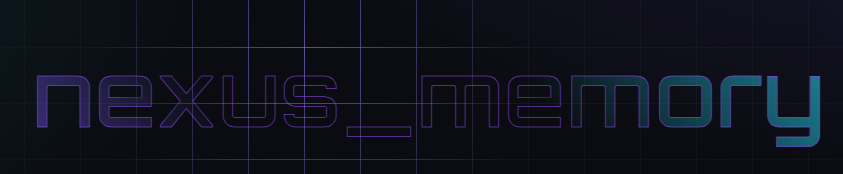

<p align="center">
  
</p>

# Nexus Memory

A **local-first**, dependency-light agent-memory library for Python. It gives an LLM application a persistent, self-managing long-term memory backed by SQLite + [`sqlite-vec`](https://github.com/asg017/sqlite-vec) — one `.db` file, no server, no network, and no model download on the default path. Everything flows through a single entry point, [`NexusMemory.process()`](src/nexus_memory/core/orchestrator.py), which validates every request with pydantic and never raises to the caller.

## Features

- **Offline & deterministic** — the default [`HashingEmbedder`](src/nexus_memory/core/embeddings.py) (768-dim, blake2b feature hashing, L2-normalized) needs no downloads and produces stable, reproducible vectors. Nothing leaves the machine.
- **Provider-agnostic** — for semantic recall, drop in the local [`FastEmbedEmbedder`](src/nexus_memory/core/embeddings.py) (fastembed/ONNX, no torch — downloads a small model once, then runs **offline**, no vendor), or the lazy [`SentenceTransformerEmbedder`](src/nexus_memory/core/embeddings.py) / [`OpenAIEmbedder`](src/nexus_memory/core/embeddings.py) adapters; bring your own fact extractor, summarizer, or directive detector. The diary **and** procedural directive extraction run on *any* model through a handoff outbox — the library itself never calls an LLM.
- **Five-layer cognitive memory** — working, episodic, semantic, and procedural layers fan out from a single `ingest`; an optional hierarchical diary (Layer V) is off by default.
- **One entry point** — every request is a dict (or JSON string) routed through `NexusMemory.process()`; all errors come back as `{"status": "error", "error": ...}`.
- **Transparent & sovereign** — `inspect`, `forget`, `pin`, and `update` your own memories.
- **Privacy by design** — an opt-in regex [PII filter](src/nexus_memory/core/privacy.py) masks emails/phones/names *before* embedding (off by default on the local path; turn it on for external embedding APIs). An optional SQLCipher [encryption](src/nexus_memory/core/security.py) hook stays off the critical path.
- **User-centric** — by default only the *user's* statements become semantic facts; assistant prose goes to the episodic diary, not the vector store.

## Install

Clone the repo and install it into your Python with `pip`. Requires Python ≥ 3.11.

```sh
# 1. Get the code.
git clone https://github.com/Sakushi-Dev/nexus_memory.git
cd nexus_memory

# 2. Install the package (editable, so source edits take effect immediately).
pip install -e .
```

This reads [`pyproject.toml`](pyproject.toml), pulls in the dependencies (`sqlite-vec`, `pydantic`, `numpy`), and registers the `src/nexus_memory/` package so `import nexus_memory` works from anywhere with that interpreter:

```python
import nexus_memory  # importable after `pip install -e .`
```

> **Multiple Pythons?** `pip` installs into the interpreter it belongs to. To target a specific one (e.g. the one your editor runs), call pip through it: `path/to/python.exe -m pip install -e .`

The optional embedder backends are extras — install what you need:

```sh
pip install -e ".[local-embeddings]"         # local semantic embedder (fastembed + bge-base, offline)
pip install -e ".[sentence-transformers]"    # SentenceTransformer embedder
pip install -e ".[openai]"                   # OpenAI embedder
```

See [Embedders](docs/usage/embedders.md) for details.

### Updating

Because the install is editable, pulling the latest code is usually all you need:

```sh
git pull
```

Re-run `pip install -e .` only if the dependencies changed (e.g. after a new release bumps requirements in [`pyproject.toml`](pyproject.toml)):

```sh
pip install -e .   # picks up new/updated dependencies
```

> **Driving it from another language?** Every request and response is a plain `dict` (or JSON string) through one `process()` entry point, so the module can sit behind a thin Python bridge (subprocess, stdin/stdout JSON, or a small socket/IPC shim) and be called from any language — no Python-specific objects cross the boundary.

## Quickstart

```python
from nexus_memory import NexusMemory

memory = NexusMemory(db_path="my_agent.db")

memory.process({
    "action": "ingest",
    "interaction": {
        "query": "where do I keep my keys?",
        "response": "You always keep your house keys in the blue ceramic bowl.",
    },
})
memory.wait()  # ingest is async; wait() makes a script deterministic

result = memory.process({"action": "assemble", "query": "where are my keys?", "top_k": 3})
print(result["context_xml"])  # prompt-ready <memory_context> XML

memory.close()
```

A runnable version lives in [`examples/basic_usage.py`](examples/basic_usage.py); the diary handoff loop is in [`examples/diary_outbox.py`](examples/diary_outbox.py).

## The layer model

A single `ingest` consolidates across layers, and `assemble` returns one unified, layer-aware `<memory_context>`:

- **I. Working** ([`working.py`](src/nexus_memory/layers/working/working.py)) — a volatile RAM ring buffer of the last *N* turns for fast recency context.
- **II. Episodic** ([`episodic/`](src/nexus_memory/layers/episodic/episodic.py)) — persistent raw dialogue plus deterministic narrative day-summaries.
- **III. Semantic** ([`semantic/`](src/nexus_memory/layers/semantic/reader.py), [`core/db.py`](src/nexus_memory/core/db.py)) — decontextualized fact vectors retrieved by cosine KNN, then re-ranked by `similarity × importance × exp(-λ · days)`.
- **IV. Procedural** ([`procedural.py`](src/nexus_memory/layers/procedural/procedural.py)) — standing behavioral directives (e.g. "Keep answers concise.") mined from the conversation by the aux LLM (Mem0-style add/update/delete, with an offline regex fallback) and injected into the assembled context.
- **V. Diary (optional, off by default)** ([`diary/`](src/nexus_memory/layers/diary/layer.py)) — a bounded session-pyramid of model-written summaries (one rolling summary per session, folded into a single growing persistent summary) that carries the conversation across session boundaries; enable with `NexusMemory(diary=True)`, then drain `pending_summaries()` and return text via `submit_summary()`.

## Actions

Every payload carries an `action`, passed to `memory.process(...)`:

| action | key fields | returns |
|---|---|---|
| `assemble` | `query`, `top_k=5`, `min_score=0.6` | `{status, context_xml, raw_facts, directives, recent_dialogue, meta, latency_ms}` |
| `ingest` | `interaction:{query, response}`, `metadata?`, `priority?` *(1-10 importance floor)* | `{status:"processing", task_id, estimated_completion_ms}` |
| `forget` | exactly one of `fact_id` / `query` *(a `query` below `forget_min_similarity` returns `not_found`)* | `{status, deleted_id}` |
| `pin` | `content`, `importance=10.0` | `{status, id, content, importance}` |
| `update` | `target_id`, `new_content` | `{status, updated_id, content}` |
| `inspect` | `type:"health"\|"episodic"\|"semantic"\|"working"\|"procedural"`, `filter?` | `{status, data}` |
| `optimize` | — | `{before_bytes, after_bytes, facts}` |
| `diary` | `day?`, `time_range?`, `store?` | `{status, period, summary, turn_count}` |
| `rule` | `op:"add"\|"list"\|"deactivate"`, `directive?`, `priority?`, `rule_id?` | add: `{status, rule}` · list: `{status, rules}` · deactivate: `{status, rule_id, deactivated}` |
| `distill` | — | `{status, promoted:[rule,...]}` |
| `pending_summaries` | `limit?` *(Layer V only)* | `{status, jobs:[{job_id, kind, session, prompt, prior_summary, input}, ...]}` |
| `submit_summary` | `job_id`, `summary` *(Layer V only)* | `{status, applied?:"session"\|"summary"}` |

Convenience wrappers: `inspect(...)`, `forget(...)`, `pin(...)`, `update(...)`, `wait(...)`, `close()`, `remember_rule(...)`, `list_rules()`, `diary(...)`, `working_snapshot()`, `reconstruct(...)`, `history(...)`, `distill()`, the unified background-job seam `drain_aux(...)` / `pending_aux_jobs(...)` / `submit_aux_job(...)`, plus `pending_summaries(...)` / `submit_summary(...)` when the diary is enabled.

Tune everything (scoring, dedup threshold, cache, privacy, per-layer settings) via [`NexusConfig`](src/nexus_memory/core/config.py).

## Documentation

Full documentation lives under [docs/](docs/) — start at [docs/index.md](docs/index.md).

- **[Architecture](docs/architecture/overview.md)** — the five-layer design, retrieval & scoring, persistence, extension points.
- **[Usage & API](docs/usage/api-reference.md)** — getting started, every action, embedders, transparency.
- **[Configuration](docs/configuration/nexus-config.md)** — `NexusConfig`, `DiaryConfig`, tuning.
- **[Use cases](docs/use-cases/agent-memory.md)** — agent memory, multiple isolated agents, behavioral rules, the diary, privacy.

## Run the tests

```sh
pip install -e ".[dev]"   # once, to get pytest
python -m pytest -q
```

## License

MIT — see [LICENSE](LICENSE).
