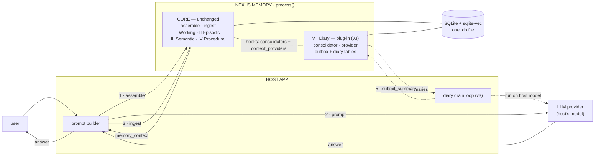
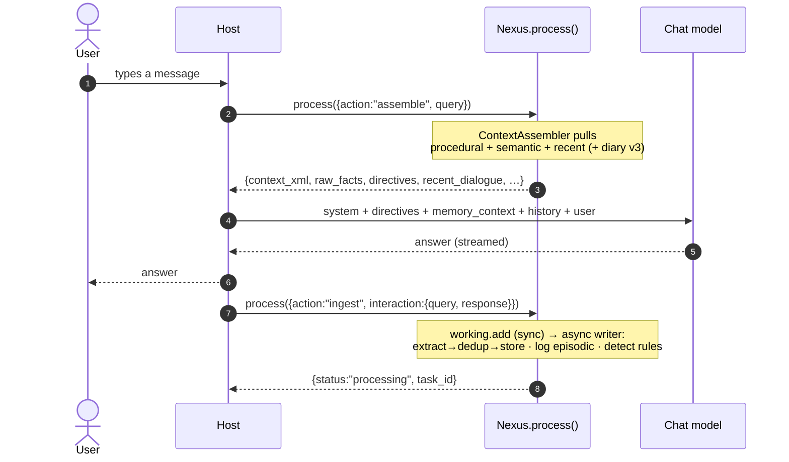
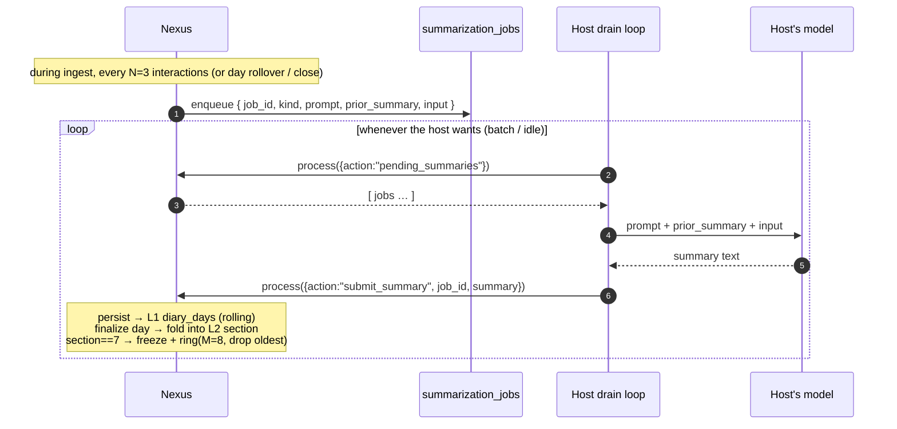

# Nexus Memory — Full I/O & Environment Visualization

How the module looks **in full scope** (the 4 cognitive layers + the planned v3 diary
outbox) and how **input/output** flow inside a fully functional host environment.

> Tip: open this file's **Markdown preview** (VS Code) to render the Mermaid diagrams.
> An ASCII version of each diagram is included for terminals that don't render Mermaid.
> Parts marked **(v3)** are the planned diary-outbox subsystem (see
> `CONTRACT-v3-diary-outbox.md`); everything else is implemented today.

---

## 1. The whole system at a glance



> **Reading it:** solid arrows **1→2→3** are one conversation turn (the host's main loop);
> dotted arrows **4→5** are the optional, asynchronous diary handoff (Layer V). `CORE` is
> today's untouched module; `V · Diary` is the removable plug-in that attaches via two hooks.
> (Internals of the 4 layers and the outbox are detailed in §2–§4.)

**ASCII master diagram**

```
            ┌──────────────────────────── HOST APP / AGENT ───────────────────────────┐
            │  user ──▶ prompt builder ──▶ [chat history RAM]      diary drain loop(v3)│
            └───────▲───────────┬───────────────────────────────────▲────────┬─────────┘
                    │           │ 1.assemble(query)   4.pending_summaries│    │5.submit_summary
            answer  │           ▼                              (v3)      │    ▼  (v3)
            ┌───────┴───────────────────── NEXUS MEMORY · process() ─────┴────┴─────────┐
            │   ┌──────────────┐         ┌──────────────────────────────┐               │
            │   │  assemble    │────────▶│  <memory_context> (output)   │               │
            │   └──────┬───────┘         └──────────────────────────────┘               │
            │   ┌──────┴───────┐                                                         │
            │   │  ingest      │                                                         │
            │   └──────┬───────┘                                                         │
            │          ▼ fan-out                                                         │
            │   ┌─────────────────────────────────────────────────────┐                 │
            │   │ I Working · II Episodic · III Semantic · IV Procedural│ CORE, untouched │
            │   └───────▲──────────────────────────────────▲──────────┘                 │
            │  context_providers seam              consolidators hook                    │
            │   ┌───────┴──────────────────────────────────┴──────────────────────────┐ │
            │   │ V · DIARY   layers/diary/  — self-contained plug-in (removable, v3)   │ │
            │   │ DiaryContextProvider · DiaryConsolidator · OUTBOX jobs · L1+L2 store  │ │
            │   └──────────────────────────────────────────────────────────────────────┘ │
            │                           ▼                                                 │
            │                 [ SQLite + sqlite-vec : ONE .db file ]                      │
            └─────────────────────────────────────────────────────────────────────────────┘
                    │ 2.system+context+history+user            ▲ 3.ingest(q,response)
                    ▼                                          │
            ┌──────────────────── LLM PROVIDER (host picks any) ───────────────────────┐
            │   chat model            (optional) external embedder                     │
            └──────────────────────────────────────────────────────────────────────────┘
```

---

## 2. One conversation turn — the main loop (read → think → write)



**Key idea:** every turn is `assemble` (read) → host calls its LLM → `ingest` (write). Nexus
never calls the LLM in this loop; it only *prepares context* and *stores results*.

---

## 3. INPUT → OUTPUT in detail

### 3a. `assemble` — the read path (what goes in / comes out)

**Input**
```json
{ "action": "assemble", "query": "Wo wohne ich und was baue ich?", "top_k": 5, "min_score": 0.6 }
```

**Pipeline**
```
query ──embed──▶ semantic KNN (top_k×2) ──graph 1-hop──▶ score(sim×imp×decay) ──filter──┐
procedural.directives() ───────────────────────────────────────────────────────────────┤──▶ assemble
episodic.recent_turns(6)  + (v3) previous-day diary + persistent_summary ────────────────┘
```

**Output** (single dict; XML is prompt-ready)
```json
{
  "status": "success",
  "context_xml": "<memory_context> … </memory_context>",
  "raw_facts":   [ {"id": 12, "content": "User: Ich wohne in Berlin", "score": 2.5, "timestamp": "…"} ],
  "directives":  [ "Respond in German." ],
  "recent_dialogue": [ {"role":"user","content":"…","timestamp":"…"} ],
  "diary": { "day":"2026-06-15", "summary":"…" },                      // (v3)
  "persistent_summary": [ {"seq":9,"days":"2026-06-01..06-07","summary":"…"} ],  // (v3)
  "meta": { "tokens_estimated": 320, "source_count": 3, "directive_count": 1, "recent_count": 6 },
  "latency_ms": 3.1
}
```

**The `context_xml` (the actual prompt block)** — a bounded *time-pyramid*:
```xml
<memory_context>
  <procedural>
    <directive priority="9">Respond in German.</directive>          <!-- IV: behavior -->
  </procedural>
  <semantic>
    <fact id="12" importance="8" score="2.50" timestamp="…">User: Ich wohne in Berlin</fact>
    <fact id="7"  importance="7" score="1.80" timestamp="…">User: Ich baue Nexus</fact>   <!-- III -->
  </semantic>
  <recent_dialogue>
    <turn role="user" timestamp="…">…</turn>                         <!-- II/I: now -->
    <turn role="assistant" timestamp="…">…</turn>
  </recent_dialogue>
  <diary day="2026-06-15">Am 15. sprach der User über … (Vortag)</diary>          <!-- v3: yesterday -->
  <persistent_summary>
    <section seq="9" days="2026-06-01..2026-06-07">Diese Woche …</section>         <!-- v3: epochs -->
  </persistent_summary>
</memory_context>
```
> Only `<fact>` carries `id="…"` — the host can cite/trust the granular facts; the narrative
> layers are context, not addressable records.

### 3b. `ingest` — the write path (fan-out across all layers)

**Input**
```json
{ "action": "ingest", "interaction": { "query": "Sprich ab jetzt deutsch.", "response": "Alles klar." } }
```

**Fan-out**
```
ingest ─┬─▶ I  Working   : add_interaction(q,a)            (synchronous, RAM)
        └─▶ (async background writer thread)
              ├─▶ III Semantic   : extract USER facts → embed → dedup(>0.90) → store
              ├─▶ II  Episodic   : log raw user + assistant turns (the diary's raw material)
              ├─▶ IV  Procedural : detect standing rules ("→ Respond in German.")
              └─▶ (v3) Layer V   : DiaryConsolidator → count++/N → enqueue job in outbox (no LLM call)
```

**Output** (returns immediately; work continues in background)
```json
{ "status": "processing", "task_id": "a30d…", "estimated_completion_ms": 50 }
```

---

## 4. Layer V — the diary handoff outbox **(v3, planned, self-contained plug-in)**

The diary is a **separate, removable layer** (`layers/diary/`): it owns its own config, tables,
scheduler, jobs and prompts, and plugs into the core through the existing **`consolidators`
hook** (ingest) and a one-time generic **`context_providers` seam** (assemble) — `writer.py`,
`reader.py`, `config.py` and `core/models.py` are **untouched**. Nexus never calls an LLM:
when a summary is due the layer emits a **job** (prompt + context) into its outbox; the host
runs it on *any* model and hands the text back.



**ASCII**
```
 ingest (every 3 turns / day-rollover / close)
        │  enqueue {prompt, context}            ┌─────────────────────────────┐
        └──────────────────────────────────────▶│  OUTBOX  summarization_jobs │
                                                 └──────────────┬──────────────┘
   host drains at its own pace  ── pending_summaries() ────────▶│
                                                                ▼
                                     ┌────────────────────────────────────┐
                                     │  host runs prompt+context on ANY    │
                                     │  model (OpenAI / Ollama / human…)   │
                                     └───────────────┬─────────────────────┘
        submit_summary(job_id, text) ◀──────────────┘
        │
        ▼  persist
   L1 diary_days[day] (rolling)  ──finalize day──▶  fold into L2 open section
                                                    section.diary_count==7 → FREEZE
                                                    ring of M=8 → overwrite oldest
```

---

## 5. End-to-end example — a full turn with real payloads

```
USER ▶ "Ich wohne in Berlin und baue ein Memory-System. Antworte ab jetzt auf Deutsch."

(1) HOST → Nexus.process(assemble)
    { "action":"assemble", "query":"Ich wohne in Berlin und baue ein Memory-System. …" }
(2) Nexus → HOST
    context_xml = <memory_context>
                    <procedural/>                         (noch leer)
                    <semantic/>                            (noch leer beim 1. Mal)
                    <recent_dialogue/>
                    <diary …/> <persistent_summary …/>     (v3, falls aktiv)
                  </memory_context>
(3) HOST → LLM:  system + <memory_context> + history + user     →  "Klar, ich wohne … cool!"
(4) HOST → Nexus.process(ingest, {query: USER, response: "Klar … cool!"})
        → I  Working:   +2 turns
        → III Semantic: "User: Ich wohne in Berlin", "User: ich baue ein Memory-System"
        → IV Procedural: detect → "Respond in German."  (source=auto)
        → II Episodic:  log user+assistant turns
        → v3 Layer V:   (every 3rd interaction) DiaryConsolidator enqueues a daily-summary job

NEXT TURN ▶ "Was weißt du über mich?"
(1) assemble → context_xml now contains:
      <procedural><directive priority="9">Respond in German.</directive></procedural>
      <semantic>  <fact id="1">User: Ich wohne in Berlin</fact>
                  <fact id="2">User: ich baue ein Memory-System</fact></semantic>
      <recent_dialogue> …letzte Turns… </recent_dialogue>
(2) HOST → LLM with that block → model answers IN GERMAN, citing Berlin + the project.
```

**Across a restart:** Working memory is empty, but Semantic facts, Procedural directives,
Episodic turns, the diary, and the persistent sections are all reloaded from the `.db` file —
so the assistant still knows you and still answers in German.

---

## 6. Legend

| Symbol | Meaning |
| :-- | :-- |
| `I · Working` | volatile RAM ring buffer (last N turns; fast recency) |
| `II · Episodic` | persistent raw turns (the diary's raw material) |
| `III · Semantic` | sqlite-vec fact vectors (user-centric), KNN + scoring |
| `IV · Procedural` | standing behavioral directives, injected into the prompt |
| `V · Diary` **(v3)** | self-contained plug-in (`layers/diary/`): rolling daily diary + persistent epoch sections, fed via the outbox |
| `consolidators` hook / `context_providers` seam | the two extension points Layer V plugs into (no core edits) |
| solid arrow | implemented today (core) |
| dotted arrow / **(v3)** | planned Layer V diary plug-in (`CONTRACT-v3-diary-outbox.md`) — removable, zero effect when off |
| one `.db` file | everything persists in a single SQLite + sqlite-vec file |

**One sentence:** the host sends `assemble` (gets a bounded `<memory_context>` time-pyramid)
and `ingest` (fans one interaction out across the core layers); the LLM is always the host's,
and the optional **Layer V diary** is a removable plug-in fed by a provider-agnostic outbox
the host drains on its own time.
```
