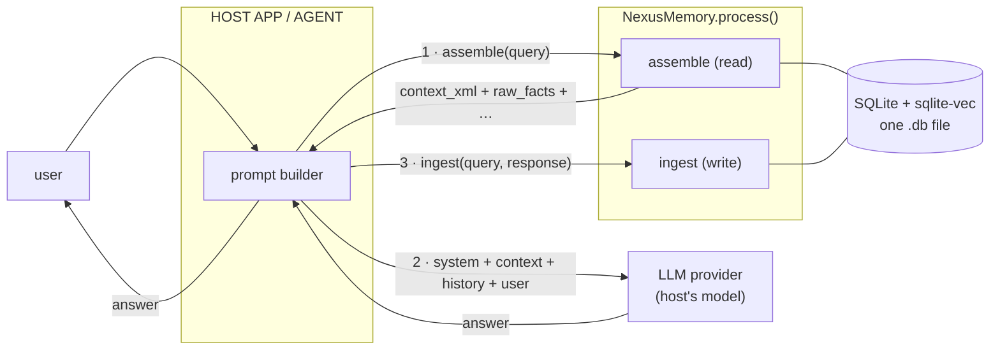
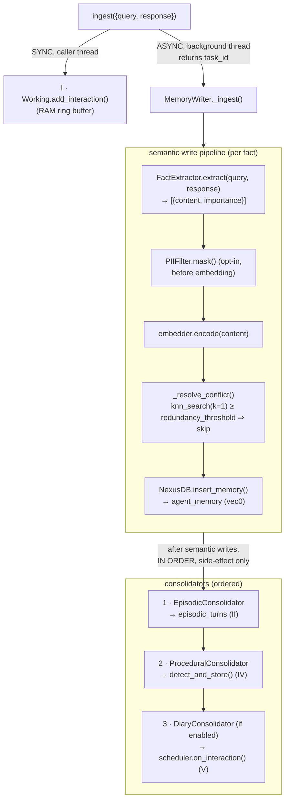
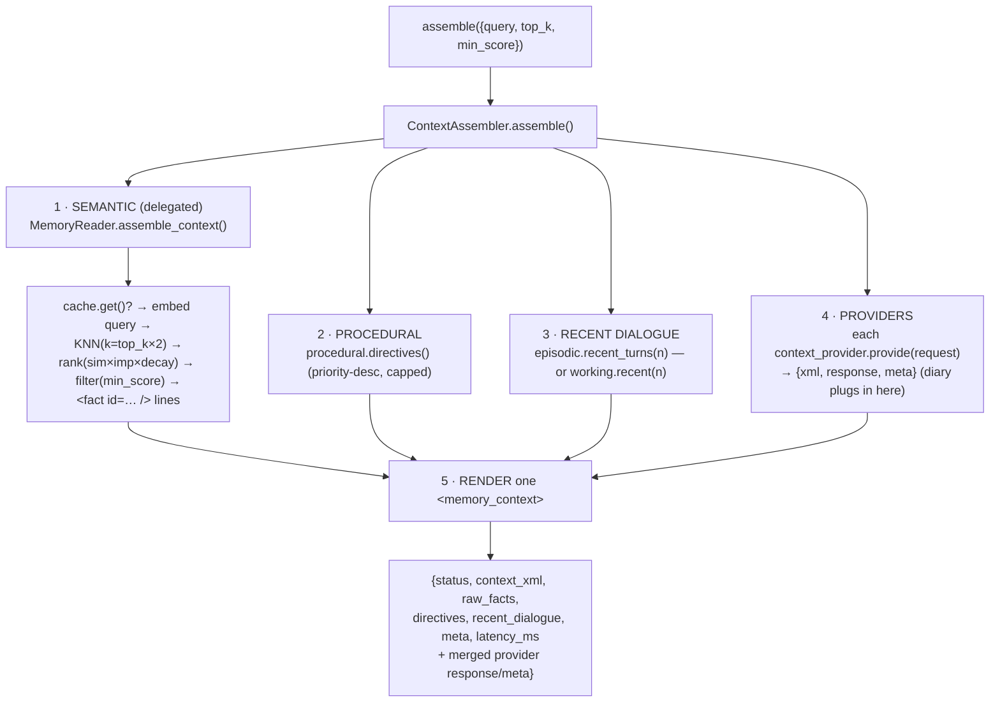

# Data Flow

This page traces the two end-to-end flows through Nexus Memory: the **ingest path** (a synchronous working-memory write plus an async writer fan-out into extract → dedup → embed → insert → ordered consolidators) and the **assemble path** (composing one prompt-ready `<memory_context>` from every active layer). Diagrams come in both Mermaid and ASCII so they render in a Markdown preview or a plain terminal.

For the request/response *shapes* of each action see [I/O: Request & Response](request-response.md); for the layer model see [Architecture: Overview](../architecture/overview.md) and [Memory Layers](../architecture/memory-layers.md).

---

## The turn loop at a glance

Every conversation turn is **`assemble` (read) → host calls its own LLM → `ingest` (write)**. Nexus never calls an LLM in this loop; it only *prepares context* and *stores results*. The optional [diary layer](../architecture/diary-layer.md) adds an asynchronous, provider-agnostic handoff on top.



```
        ┌──────────────── HOST APP / AGENT ────────────────┐
 user ─▶│ prompt builder            [chat history in RAM]   │─▶ answer
        └──▲────────┬───────────────────────────▲──────────┘
   answer │ 1.assemble(query)                   │ 3.ingest(query, response)
          │         ▼                           │
   ┌──────┴──────────────── NexusMemory.process() ──────────┐
   │   assemble ─▶ <memory_context> (returned to host)       │
   │   ingest   ─▶ Layer I sync write + async writer fan-out  │
   │                         │                                │
   │                         ▼   [ SQLite + sqlite-vec : ONE .db file ]
   └─────────────────────────────────────────────────────────┘
          │ 2.system + context + history + user      ▲ answer
          ▼                                          │
   ┌──────────────── LLM PROVIDER (host picks any) ──┴───────┐
   │  chat model           (optional) external embedder       │
   └──────────────────────────────────────────────────────────┘
```

The entry point for both flows is [`NexusMemory.process(payload)`](../../src/nexus_memory/core/orchestrator.py), which validates the payload, routes on `action`, and **never raises** — every error returns as `{"status": "error", "error": str}`.

---

## The ingest path (write)

`process({"action": "ingest", "interaction": {query, response}, metadata?, priority?})` does two things: it updates **Layer I (working memory) synchronously** on the caller's thread, then dispatches the durable writes to a **background thread** and returns immediately with a `task_id`. The optional `priority` (1–10) acts as an **importance floor**: every fact extracted from this interaction is stored at *at least* `priority`, never lowering a higher heuristic importance.

```python
self.working.add_interaction(query, response)          # Layer I — sync, RAM
task_id = self.writer.ingest_async(interaction, metadata)  # Layers II–V — async
return {"status": "processing", "task_id": task_id,
        "estimated_completion_ms": 50}
```

`estimated_completion_ms` is a coarse, non-binding hint (`_INGEST_ESTIMATE_MS = 50`), not a measurement. See [`orchestrator._route`](../../src/nexus_memory/core/orchestrator.py).

### Fan-out diagram



```
ingest({query, response})
   │
   ├─ (SYNC)  working.add_interaction(query, response)        # Layer I, immediate, RAM
   │
   └─ (ASYNC) writer.ingest_async(interaction, metadata) ─▶ background thread
                 │   returns task_id (uuid) immediately
                 ▼
            FactExtractor.extract(query, response) → [{content, importance}]
                 │
                 ▼  for each fact (embed outside lock, dedup+insert under _write_lock):
            [PII mask?] → embedder.encode(content) → _resolve_conflict()
                 │           (knn_search k=1; similarity ≥ redundancy_threshold ⇒ skip)
                 ▼
            NexusDB.insert_memory(...) ──▶ agent_memory (vec0)   # Layer III
                 │
                 ▼  after semantic writes, run consolidators IN ORDER:
            1. EpisodicConsolidator   → episodic_turns           # Layer II
            2. ProceduralConsolidator → detect_and_store()       # Layer IV
            3. DiaryConsolidator      → scheduler.on_interaction()  # Layer V (if on)
```

### Per-fact write critical section

The dedup-then-insert step is the only locked region, and the embedding is computed *outside* it. From [`writer._dedup_and_write`](../../src/nexus_memory/layers/semantic/writer.py):

```python
embedding = self._embedder.encode(content)   # outside the lock
with self._write_lock:                        # threading.Lock
    decision = self._resolve_conflict(content, embedding)
    if decision == "redundant":
        return None                           # nearest neighbour too similar
    return self._db.insert_memory(content=content, embedding=embedding,
                                  importance=importance, metadata=metadata)
```

| Stage | Code | What it does | Default knob |
|-------|------|--------------|--------------|
| Extract | [`FactExtractor.extract`](../../src/nexus_memory/layers/semantic/extraction.py) | Splits the interaction into scored atomic facts; the default `SpeakerAwareExtractor` attributes each to user/assistant and drops assistant filler | `semantic_include_assistant` |
| Mask | [`PIIFilter.mask`](../../src/nexus_memory/core/privacy.py) | Redacts emails → phones → names **before** embedding (opt-in); masking failures store unmasked content and log | `pii_filter_enabled` (`False`) |
| Embed | [`Embedder.encode`](../../src/nexus_memory/core/embeddings.py) | Returns an L2-normalized vector (cosine = dot product) | `dim` (`768`) |
| Dedup | [`writer._resolve_conflict`](../../src/nexus_memory/layers/semantic/writer.py) | `knn_search(k=1)`; if `similarity = 1 − distance ≥ threshold`, the fact is `redundant` and skipped | `redundancy_threshold` (`0.90`) |
| Insert | [`NexusDB.insert_memory`](../../src/nexus_memory/core/db.py) | Writes one row into the `agent_memory` vec0 table with an explicit UTC `timestamp` | — |

### Ordered consolidators (the inter-layer fan-out)

After the semantic writes, the writer runs each configured [`Consolidator`](../../src/nexus_memory/core/consolidation.py) **in a fixed order**, on the same background thread, inside `try/except` — a consolidator failure is logged and skipped and **never rolls back the semantic write**. The whole step is a no-op when `auto_consolidate` is off. See [`writer._run_consolidators`](../../src/nexus_memory/layers/semantic/writer.py) and the wiring in [`orchestrator.__init__`](../../src/nexus_memory/core/orchestrator.py):

```python
self.consolidators = [
    EpisodicConsolidator(self.episodic, lambda: self.session_id),  # 1 · Layer II
    ProceduralConsolidator(self.procedural),                       # 2 · Layer IV
]
# Layer V (diary) is appended LAST, only when an enabled DiaryConfig is passed:
self.consolidators.append(diary_layer.consolidator)                # 3 · Layer V
```

| Order | Consolidator | Target | Effect |
|------:|--------------|--------|--------|
| 1 | `EpisodicConsolidator` | Layer II | Logs the raw user + assistant turns into `episodic_turns` (tagged with `session_id`) |
| 2 | `ProceduralConsolidator` | Layer IV | Detects standing rules via the detector and upserts them (`procedural_rules`) |
| 3 | `DiaryConsolidator` *(if enabled)* | Layer V | Calls `scheduler.on_interaction()`; never an LLM call — it may enqueue an outbox job |

> **Order matters.** The diary consolidator is appended last so the `episodic_turns` it summarizes already exist when the scheduler reads them.

### Visibility & ordering guarantees

* **Async is real.** Facts written by `ingest` are *not* visible to an `assemble` issued immediately afterward. Call [`wait()`](../../src/nexus_memory/core/orchestrator.py) (or `close()`, which waits internally) first.
* **One row per identical fact.** Embedding is computed outside the lock, but the check-then-insert is atomic under `_write_lock`, so the same fact submitted twice (even concurrently) collapses to a single row.
* **Working memory is the synchronous exception.** Layer I reflects the turn the instant `ingest` returns, even before the async pipeline completes; it is also the recent-dialogue fallback when the episodic layer is disabled.

For the durable schema each stage writes to (the `agent_memory` vec0 table, `episodic_turns`, `procedural_rules`, diary tables), see [Architecture: Persistence](../architecture/persistence.md).

---

## The assemble path (read)

`process({"action": "assemble", "query", top_k=5, min_score=0.6})` builds **one** `<memory_context>` document by composing every active layer. [`ContextAssembler.assemble`](../../src/nexus_memory/core/context.py) is the coordinator; it does **not** reimplement KNN/scoring — it delegates the semantic block to [`MemoryReader`](../../src/nexus_memory/layers/semantic/reader.py) and re-nests the rendered `<fact .../>` lines verbatim.



```
process({"action":"assemble", "query", top_k=5, min_score=0.6})
   │
   ▼
ContextAssembler.assemble(request)
   │
   ├─ 1. SEMANTIC (delegated) ── MemoryReader.assemble_context()
   │        cache.get()? → embed query → KNN(k=top_k*2)
   │        → rank(sim×imp×decay) → filter(min_score)
   │        → <fact id="…" importance="…" score="…" timestamp="…">…</fact>
   │
   ├─ 2. PROCEDURAL ── procedural.directives()        (priority-desc, capped)
   │
   ├─ 3. RECENT DIALOGUE ── episodic.recent_turns(n)  (or working.recent(n))
   │
   ├─ 4. PROVIDERS ── each context_provider.provide(request) → {xml, response, meta}
   │        (the diary plugs in here; empty list ⇒ byte-identical legacy output)
   │
   └─ 5. RENDER into one <memory_context>, splicing provider fragments
          after <recent_dialogue>; merge provider response/meta into the result
```

### The five composition steps

| Step | Source | Produces | Notes |
|-----:|--------|----------|-------|
| 1 · Semantic | [`MemoryReader.assemble_context`](../../src/nexus_memory/layers/semantic/reader.py) | `raw_facts` + `<fact .../>` lines | KNN **over-retrieves** `k = top_k*2`, then [scoring](../architecture/retrieval-and-scoring.md) re-ranks and `min_score` filters before capping to `top_k`. Only this block carries `id="…"`. |
| 2 · Procedural | [`ProceduralStore.directives`](../../src/nexus_memory/layers/procedural/procedural.py) | `directives: [str]` | Gathered only when `procedural_enabled`; already priority-desc. The renderer surfaces rank as `<directive priority="…">`. |
| 3 · Recent dialogue | [`context._recent_dialogue`](../../src/nexus_memory/core/context.py) | `recent_dialogue: [{role, content, timestamp}]` | Episodic store when `episodic_enabled` (count = `episodic_recent_turns`), else the volatile working buffer — callers always get *some* recency. |
| 4 · Providers | each `provider.provide(request)` | spliced `xml` + merged `response`/`meta` | The [diary layer](../architecture/diary-layer.md) attaches here. With no providers the output is byte-identical to the three built-in sections. |
| 5 · Render | [`context._render`](../../src/nexus_memory/core/context.py) | `context_xml` | Fact lines are re-nested verbatim; procedural/recent text is XML-escaped (`escape` for text, `quoteattr` for attributes). |

### The rendered document

The result is a bounded **time-pyramid** — standing behavior, then granular facts, then the most recent turns, then (when enabled) the diary's narrative layers:

```xml
<memory_context>
  <procedural>
    <directive priority="9">Keep answers concise.</directive>        <!-- IV: behavior -->
  </procedural>
  <semantic>
    <fact id="12" importance="7" score="0.83" timestamp="…">User: Ich wohne in Berlin</fact>  <!-- III -->
  </semantic>
  <recent_dialogue>
    <turn role="user" timestamp="…">…</turn>                        <!-- II / I: now -->
    <turn role="assistant" timestamp="…">…</turn>
  </recent_dialogue>
  <!-- spliced after <recent_dialogue>, only when Layer V is enabled: -->
  <diary session="current" seq="7">…this session so far…</diary>           <!-- V: current -->
  <diary session="sess-0006" seq="6">…the previous session…</diary>        <!-- V: prior -->
  <persistent_summary>…the one growing cross-session summary…</persistent_summary>
</memory_context>
```

> Only `<fact>` carries `id="…"` — hosts can cite/trust the granular facts; the narrative layers are context, not addressable records. A backward-compat test greps `<fact id="(\d+)"` and asserts there are `≤ top_k` of them.

### The assemble response

`assemble` returns a backward-compatible superset (see [`ContextAssembler.assemble`](../../src/nexus_memory/core/context.py)):

```python
{
  "status": "success",
  "context_xml": "<memory_context>…</memory_context>",
  "raw_facts": [{"id", "content", "score", "timestamp"}, …],   # introspection
  "directives": ["Keep answers concise.", …],
  "recent_dialogue": [{"role", "content", "timestamp"}, …],
  "meta": {"tokens_estimated", "source_count",
           "directive_count", "recent_count", …provider meta},
  "latency_ms": 1.23,
  # …plus any response keys merged from context_providers (e.g. diary)
}
```

Field shapes are catalogued in [I/O: Request & Response](request-response.md).

---

## A full turn, end to end

This is the loop in code — `assemble` to build the prompt, the host's own model to answer, `ingest` to persist, and `wait()` so the next read sees the new facts. Adapted from [`examples/basic_usage.py`](../../examples/basic_usage.py):

```python
from nexus_memory import NexusMemory

nexus = NexusMemory("nexus_memory.db")

# 1 · READ — assemble the prompt block for this turn
ctx = nexus.process({"action": "assemble", "query": "Was weißt du über mich?"})
prompt = system + ctx["context_xml"] + history + user_message

# 2 · THINK — the HOST calls its OWN model (Nexus never does)
answer = my_llm(prompt)

# 3 · WRITE — fan the interaction out across the layers (async)
nexus.process({"action": "ingest",
               "interaction": {"query": user_message, "response": answer}})

nexus.wait()   # join background writers before the next assemble / shutdown
```

**Across a restart:** Layer I (working memory) starts empty, but Semantic facts, Procedural directives, Episodic turns, and any diary state are all reloaded from the single `.db` file — so the assistant still knows the user and still honors standing directives. See [Persistence](../architecture/persistence.md) and [Concurrency](../architecture/overview.md).

---

## The diary outbox handoff (Layer V, optional)

When the [diary layer](../architecture/diary-layer.md) is enabled, the third consolidator may enqueue a summarization **job** into the `summarization_jobs` outbox during ingest. The diary layer **never calls an LLM** — the host drains the outbox on its own schedule, runs the prompt on *any* model, and submits the text back:

```
ingest ──▶ DiaryConsolidator ──▶ DiaryScheduler.on_interaction()
                                       │ every N=update_every interactions / session rollover / close()
                                       ▼
                            summarization_jobs (OUTBOX)
                                       │
   host drains ── nexus.pending_summaries() ──▶ [{job_id, kind, prompt, prior_summary, input}]
   text = my_llm(job["prompt"], job["prior_summary"], job["input"])
   nexus.submit_summary(job_id, text) ──▶ persist session diary → fold sessions_per_summary into the one persistent summary
```

This handoff is fully covered in [Architecture: Diary Layer](../architecture/diary-layer.md) and the [`examples/diary_outbox.py`](../../examples/diary_outbox.py) walkthrough.

---

## See also

* [I/O: Request & Response](request-response.md) — the exact payload and response shape of every action.
* [Architecture: Overview](../architecture/overview.md) — the layer model, extension seams, and concurrency.
* [Memory Layers](../architecture/memory-layers.md) · [Retrieval & Scoring](../architecture/retrieval-and-scoring.md) · [Persistence](../architecture/persistence.md).
* [Usage: Getting Started](../usage/getting-started.md) — install, construct, and run the turn loop.
